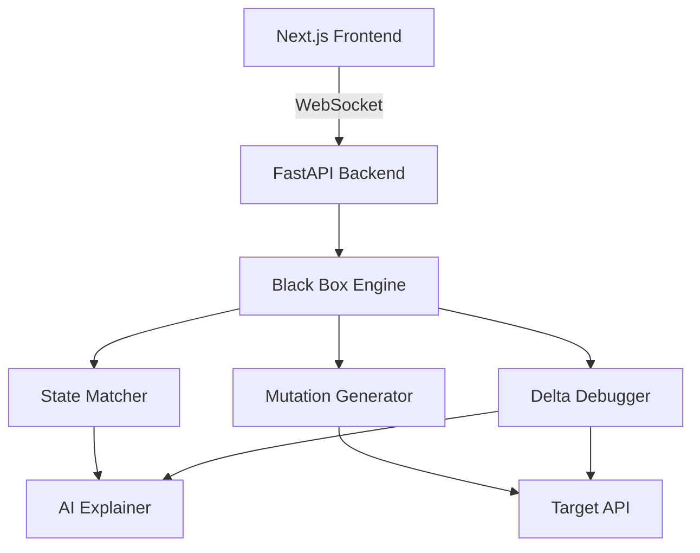

# BLACK BOX // SYNTHETIC PATIENT ZERO

Black Box is an autonomous API discovery and chaos engineering engine. It maps unknown API perimeters by analyzing request/response shapes, building a behavioral state graph dynamically. It then injects mutations (Payload Fuzzing, Latency, Concurrency) to force the system into a failure state, isolating the exact "Patient Zero" sequence using Delta Debugging.

## Features
- **Dynamic State Inference**: Automatically maps APIs without OpenAPI specs.
- **Chaos Injection**: Synthesizes failure states using advanced mutations.
- **Delta Debugger**: Automatically minimizes failure sequences to find the exact trigger.
- **AI Integration**: Generates human-readable labels for inferred states and failure explanations.
- **Neon-Brutalist UI**: Features a highly interactive, animated ReactFlow visualization.

## Architecture

To learn more about Next.js, take a look at the following resources:

- [Next.js Documentation](https://nextjs.org/docs) - learn about Next.js features and API.
- [Learn Next.js](https://nextjs.org/learn) - an interactive Next.js tutorial.

You can check out [the Next.js GitHub repository](https://github.com/vercel/next.js) - your feedback and contributions are welcome!

## Deploy on Vercel

The easiest way to deploy your Next.js app is to use the [Vercel Platform](https://vercel.com/new?utm_medium=default-template&filter=next.js&utm_source=create-next-app&utm_campaign=create-next-app-readme) from the creators of Next.js.

Check out our [Next.js deployment documentation](https://nextjs.org/docs/app/building-your-application/deploying) for more details.
